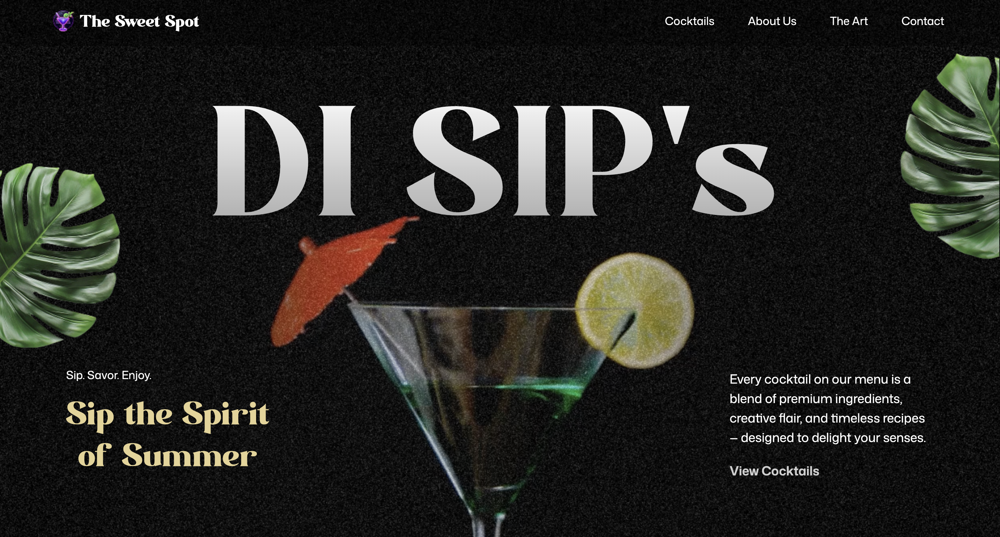

# 🍸 Di Sips

> A modern cocktail bar website designed to showcase drinks through a bold, playful, and immersive digital experience.

**Di Sips** is a responsive cocktail bar website built with React and GSAP, combining smooth animations, rich imagery, and a modern visual design to create an engaging experience for visitors.

The project was created as a frontend development and creative design project, with a focus on animation, responsive layouts, and bringing a hospitality brand to life through code.

---

## ✨ Live Demo

🌐 **Live Website:** https://cocktail-menu-gsap.vercel.app/

---

## 📸 Preview



---

## 🎯 Project Goals

The goal of Di Sips was to create more than just a menu website.

I wanted to experiment with:

* Immersive web animations
* Scroll-based interactions
* Creative image layouts
* Responsive design
* Modern typography
* A strong visual identity
* Smooth transitions between sections
* Creating a memorable experience for visitors

The design was inspired by modern cocktail bars and nightlife brands, with a playful South African-inspired approach to the drinks and menu.

---

## 🚀 Features

### 🍹 Cocktail Showcase

A visually engaging section for showcasing cocktails and mocktails with imagery, descriptions, and pricing.

### 🎬 Animated Hero Section

The landing section uses layered imagery, typography, and GSAP animations to create an engaging first impression.

### 🖱️ Scroll Animations

GSAP and ScrollTrigger are used to create animations that respond to the user's scrolling.

### 📱 Responsive Design

The website adapts across:

* Desktop
* Tablet
* Mobile

### 🧭 Smooth Navigation

Navigation allows visitors to quickly move between key sections such as:

* About
* Cocktails
* Menu

### 🎨 Custom Visual Design

The interface uses custom imagery, typography, colors, and layouts rather than relying on a generic template.

---

## 🛠️ Tech Stack

### Frontend

* **React**
* **JavaScript**
* **Vite**
* **Tailwind CSS**

### Animation

* **GSAP**
* **ScrollTrigger**
* **SplitText**

### Development Tools

* **Vite**
* **Yarn**
* **Git & GitHub**
* **VS Code**

---

## 📂 Project Structure

```text
Di Sips/
├── public/
│   ├── images/
│   ├── videos/
│   └── ...
│
├── src/
│   ├── components/
│   ├── constants/
│   ├── App.jsx
│   ├── main.jsx
│   └── ...
│
├── index.html
├── package.json
├── vite.config.js
└── README.md
```

---

## ⚙️ Getting Started

To run the project locally, clone the repository:

```bash
git clone YOUR_REPOSITORY_URL
```

Navigate into the project:

```bash
cd di-sips
```

Install the dependencies:

```bash
yarn install
```

Start the development server:

```bash
yarn dev
```

The application will then be available through the local development URL provided by Vite.

---

## 🏗️ Production Build

To create a production build:

```bash
yarn build
```

To preview the production build locally:

```bash
yarn preview
```

---

## 💡 What I Learned

This project gave me the opportunity to strengthen my understanding of building visually focused React applications.

Some of the main things I explored were:

* Building reusable React components
* Creating responsive layouts
* Working with GSAP animations
* Using ScrollTrigger for scroll-based interactions
* Creating layered visual effects
* Managing static assets in a Vite project
* Designing mobile-friendly interfaces
* Structuring a frontend project for deployment
* Improving the relationship between design and user experience

---

## 🎨 Design Philosophy

The goal was to make the website feel **fun, energetic, and premium** without making it difficult to navigate.

Rather than overwhelming the visitor with information, the design uses:

**Strong visuals + animation + simple navigation + focused content**

to create an experience that feels closer to visiting a modern cocktail bar than simply browsing a traditional restaurant website.

---

## 🔮 Future Improvements

Potential improvements for future versions include:

* Online reservations
* Cocktail filtering
* Interactive cocktail menu
* Customer reviews
* Location and contact integration
* CMS integration for managing the menu
* Online ordering
* Backend API integration
* Accessibility improvements
* Performance optimization for large media assets

---

## 👩🏾‍💻 About the Developer

**Shasha Boipelo Motsubele**

Frontend / Full-Stack Developer with an interest in building modern web applications, creative digital experiences, and technology-driven solutions.

I enjoy combining **development, design, and digital marketing** to create products that are not only functional but also enjoyable to use.

### Connect With Me

* 🌐 Portfolio: [shashadev.com](https://shashadev.com)
* 💼 LinkedIn: www.linkedin.com/in/shasha-boipelo-motsubele-a4216a138
* 🐙 GitHub: https://github.com/Boipelo11

---

## 📄 License

This project was created for educational, portfolio, and demonstration purposes.

© 2026 Shasha Boipelo Motsubele. All rights reserved.
